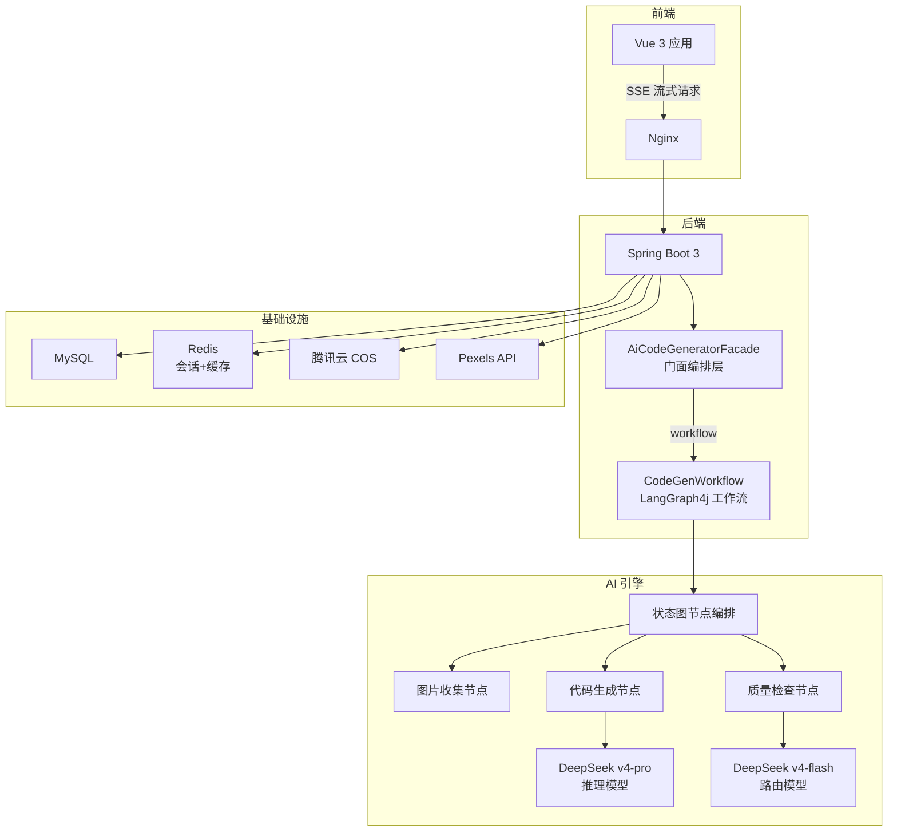
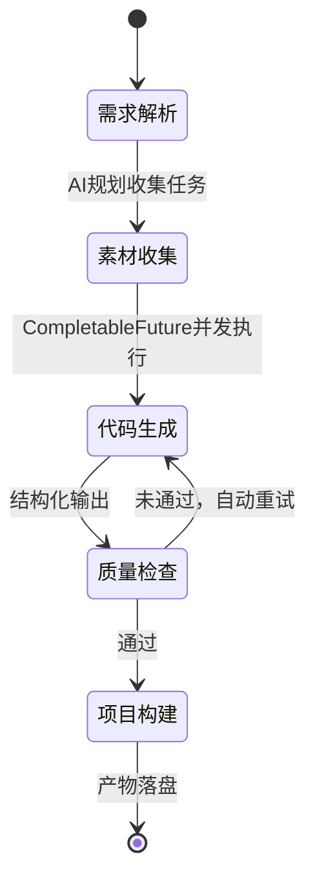

# Code Zero Studio


**GitHub**: [github.com/EthanYuan06/ey-ai-code-mother](https://github.com/EthanYuan06/ey-ai-code-mother)

---

## 🔧技术栈

### 后端

| 类别      | 技术                                                         |
| --------- | ------------------------------------------------------------ |
| 语言/框架 | Java 21 + Spring Boot 3.5.3                                  |
| AI 框架   | LangChain4j 1.3.0 + LangGraph4j 1.6.0                        |
| 数据库    | MySQL + MyBatis-Flex 1.11.0                                  |
| 缓存/会话 | Redis + Spring Session + Caffeine                            |
| AI 模型   | DeepSeek（v4-flash / v4-pro）+ 阿里云 DashScope（qwen3.7-flash / wan2.2-t2i-flash） |
| 外部服务  | 腾讯云 COS（对象存储）、Pexels（图片搜索）、Selenium（网页截图） |
| API 文档  | Knife4j OpenAPI3                                             |
| 工具库    | Hutool 5.8                                                   |

### 前端

| 类别 | 技术                              |
| ---- | --------------------------------- |
| 框架 | Vue 3 + Vite                      |
| 部署 | Nginx + Docker Compose 多容器编排 |

## 核心亮点

| 指标 | 数据 |
|------|------|
| 图片收集节点耗时 | **降低 66%**（AI 规划 + CompletableFuture 按类别并发执行） |
| 单次文章生成 Token 成本 | **下降 70%**（底层大模型切换为 DeepSeek） |
| AI 并发调用阻塞 | **零阻塞**（多例模式为每个 AI Service 创建独立 ChatModel 实例） |
| 工具扩展 | **零代码改动**（Spring Bean + ToolManager 统一注册，插件化热插拔） |
| 会话隔离 | **memoryId 级别隔离**，避免多应用上下文串扰 |

---

## 

### 

### 前端

| 类别 | 技术 |
|------|------|
| 框架 | Vue 3 + Vite |
| 部署 | Nginx + Docker Compose 多容器编排 |

---

## 系统架构

### 整体架构



### 工作流节点编排（LangGraph4j）



### 混合架构设计

| 维度 | 工作流模式（主） | 原生成模式（兜底） |
|------|-----------------|-------------------|
| AI 调用 | LangGraph4j 状态图 | LangChain4j AiService |
| 文件操作 | Tool 直接调用 | Parser + Saver 管道 |
| 流式输出 | 步骤事件 → SSE 转换 | Flux\<String\> 直接透传 |
| 适用场景 | 多文件/复杂项目/Vue部署 | HTML快速生成/调试 |


### 关键设计

- **工具管理**：工具注册为 Spring Bean，由 ToolManager 统一管理，支持插件化热插拔，新增工具零代码改动
- **幻觉抑制**：系统提示词约束 + 幻觉工具名拦截策略，有效抑制大模型工具调用幻觉
- **对话记忆**：Redis + LangChain4j ChatMemory，通过 memoryId 隔离不同应用会话
- **成本优化**：路由节点接入低成本/快响应模型（qwen3.7-flash），复杂代码生成接入推理模型（DeepSeek v4-pro），平衡调用成本与响应速度
- **并发安全**：多例模式为每个 AI Service 创建独立 ChatModel 实例，Caffeine 缓存管理实例生命周期（最大 1000 实例，1 小时过期）

---

## 🚀 快速启动

```bash
# 1. 克隆项目
git clone https://github.com/EthanYuan06/ey-ai-code-mother.git

# 2. 配置环境变量
cp .env .env
# 编辑 .env 填写 DeepSeek、DashScope、COS、Pexels 等 API Key

# 3. Docker Compose 一键启动
docker-compose up -d

# 4. 访问
# 前端: http://localhost
# 后端 API: http://localhost:8123/api
# API 文档: http://localhost:8123/api/doc.html
```
